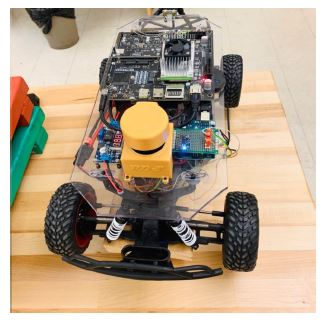

# Vision-Based-Object-detection-for-autonomous-control

In recent years, autonomous cars have drawn major interest at both academic and industrial researches.
The ability to have intelligence using neural network has created a necessity to develop autonomous
cars. For a car to be truly autonomous it must localize itself in the environment and keep track of the
objects around it to navigate safely. Several researches have proposed obstacle avoidance through
global map recognition, real-time sensor output and binary obstacle image recognition through color
appearance. They treat all kind of obstacle the same way. The need to perform distinct autonomous
maneuver for each class of object is overlooked. Our study proposes a methodology to identify the
type of obstacle in real-time and perform distinct autonomous maneuver based on the obstacle type.
Obstacle based autonomous maneuver of rally-car was achieved by integrating image recognition
algorithm into ROS.

### <ins>Table of contents</ins>:
  - [ Introduction ](#intro)
  - [ Data Description ](#desc)
  - [ EDA ](#eda)
  - [ Result ](#res)
  - [ Conclusion ](#con)

### Introduction:
Cars that can navigate through obstacles and perform autonomous maneuver is most fancied and sought out today.
Cars, to be called "Autonomous", they must have the capability to know the environment through which they navigate
and keep track of the objects around them, so it can make appropriate decision and navigate safely for a desired
mission. Obstacle avoidance technology is a hot spot in field of autonomous cars, and also is one of the most important
embodiment of intelligent vehicles.
Several researches propose object detection and obstacle avoidance through global map recognition, real-time sensor
output and binary obstacle image recognition through color appearance. They consider all obstacles as a single
class and perform maneuver based on the information from popular sensors like ultrasonic sensors, laser rangefinders,
radar, stereo vision, optical flow, and depth from focus. The need to perform distinct autonomous maneuver for each
class of object is overlooked.

|  | 
|:--:| 
| ** Rally-Car with Jetson TX2 Hex-Core Processor **|

The obstacle avoidance can be performed through two different methods: one is global obstacle avoidance and another
is local obstacle avoidance. In local obstacle avoidance method, 2-D or 3-D Lidar are used to capture useful information.
Lidar has the advantages of high precision, large detection range, and fast sweep frequency[2]. In our study, I
primarily use the local obstacle detection method. The ability to provide intelligence to the rally-car to perform distinct
maneuver for the identified class of object is studied. This includes accurate classification of the object in the track for
re-planning the path in order to make a safe maneuver. I considered this as our motivation to integrate neural network
concepts taught in class into ROS to achieve localization and trajectory planning for autonomous control of the rally-car
