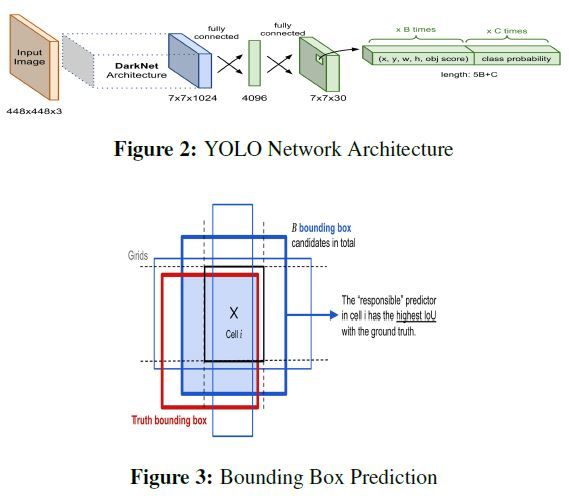
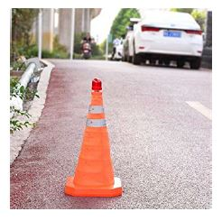
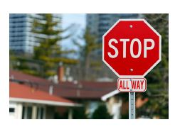
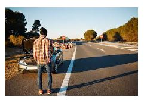
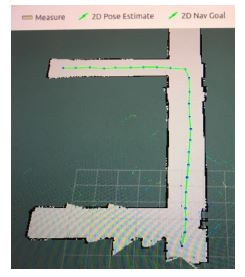
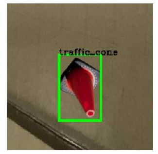
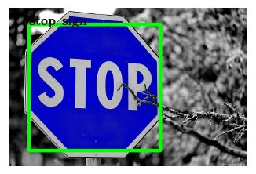
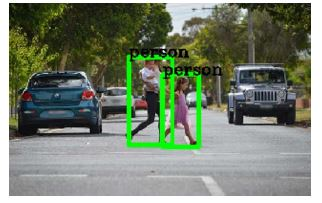
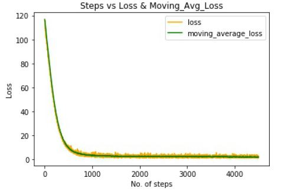
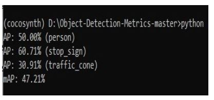

# OBJECT DETECTION FOR AUTONOMOUS VEHICLES

In recent years, autonomous cars have drawn major interest at both academic and industrial researches.
The ability to have intelligence using neural network has created a necessity to develop autonomous
cars. For a car to be truly autonomous it must localize itself in the environment and keep track of the
objects around it to navigate safely. Several researches have proposed obstacle avoidance through
global map recognition, real-time sensor output and binary obstacle image recognition through color
appearance. They treat all kind of obstacle the same way. The need to perform distinct autonomous
maneuver for each class of object is overlooked. Our study proposes a methodology to identify the
type of obstacle in real-time and perform distinct autonomous maneuver based on the obstacle type.
Obstacle based autonomous maneuver of rally-car was achieved by integrating image recognition
algorithm into ROS.

### <ins>Table of contents</ins>:

- [ Introduction ](#intro)
- [ Methodology ](#meth)
- [ Data Description ](#desc)
- [ Result ](#res)
- [ Conclusion ](#con)

### Introduction:

Cars that can navigate through obstacles and perform autonomous maneuver is most fancied and sought out today.Cars, to be called "Autonomous", they must have the capability to know the environment through which they navigate and keep track of the objects around them, so it can make appropriate decision and navigate safely for a desired mission. Obstacle avoidance technology is a hot spot in field of autonomous cars, and also is one of the most important embodiment of intelligent vehicles.
Several researches propose object detection and obstacle avoidance through global map recognition, real-time sensor output and binary obstacle image recognition through color appearance. They consider all obstacles as a single class and perform maneuver based on the information from popular sensors like ultrasonic sensors, laser rangefinders, radar, stereo vision, optical flow, and depth from focus. The need to perform distinct autonomous maneuver for each class of object is overlooked.

|                         |
| :------------------------------------------------: |
| ** Rally-Car with Jetson TX2 Hex-Core Processor ** |

The obstacle avoidance can be performed through two different methods: one is global obstacle avoidance and another is local obstacle avoidance. In local obstacle avoidance method, 2-D or 3-D Lidar are used to capture useful information. Lidar has the advantages of high precision, large detection range, and fast sweep frequency. The ability to provide intelligence to the rally-car to perform distinct maneuver for the identified class of object is studied. This includes accurate classification of the object in the track for re-planning the path in order to make a safe maneuver. I considered this as our motivation to integrate neural network concepts taught in class into ROS to achieve localization and trajectory planning for autonomous control of the rally-car

### Methodology:

The method is to integrate two distinct parts: One is physical component i.e., the rally car run through robot operatingsystem and another is vision i.e., the intelligence provided by the neural network algorithm(YOLO). The rally car can navigate on a pre-defined path with specified acceleration using AMCL algorithms and SLAM algorithm. The Inertial measurement unit (IMU) data is used to achieve steady movement along a particular direction. A trained algorithm capable of identifying three different classes of objects is provided to rally car. Through this intelligence, the rally-car performs distinct maneuver by identifying the class of object in its pre-defined path of motion

YOLO was chosen as base model to perform object detection and bounding box prediction for the study primarily because the The camera works at 30 frames per second. The YOLO network divides the images into S X S grid. The grid cell that has the center of an object is responsible for
detecting that object. Each grid predicts a bounding box and confidence scores for those boxes. The confidence score for the bounding box is given as product of probability of object and intersection of union for a chosen threshold. It is made up of 24 convolutional layers followed by 2
fully connected layers. Instead of the inception modules used by GoogLeNet, it uses 1 _ 1 reduction layers followed by 3 _ 3 convolutional layers. The output of the network is 7 _ 7 _ 30 tensor.

### Data description:

For this project, 3 classes of objects were considered. The three classes that were chosen are Person (Humans), Traffic cone and Stop sign. The data set used for our study consist partly the data available in the **MS COCO** data set and partly synthetically generated. The COCO is a large-scale object detection, segmentation, and captioning dataset.60 images from each class were selected in random.

|  |  |  |
| :---------------------------: | :---------------------------: | :-----------------------------: |
| Synthetically generated cone  |    Stop sign from MS COCO     |       Person from MS COCO       |

Annotation of images were done through scripted algorithm. First, using the gimp software tool, a mask for the foreground of the images are created. These contoured images are then passed to the algorithm to create annotations.The algorithm, generates a polygon based on the contours defined by the gimp software tool. Using this polygon information, bounding boxes are generated for each image and stored in JSON format. The JSON format is converted into xml file before feeding them into our model for training.

### Result:

A pre-defined map of a particular location is required to perform maneuver in local obstacle detection method used in this study.

[]
|:-:|
|**A known map constructed**|

Transfer learning was performed on the original YOLO model. YOLO model is originally trained on
the COCO dataset with 80 classes and 250,000 images. The trained weights of this model is used as initial weights to train the YOLO model on the reduced custom selected classes of 150 images. 30 images consisting of three classes were used for validation.The performance of the custom trained model for our customized dataset was relatively good. The time consumed for training the transformed model was less on comparison to the popular R-CNN and Mask R-CNN.

|  |  |  |
| :---------------------------: | :---------------------------: | :-----------------------------: |
| Synthetically generated cone  |    Stop sign from MS COCO     |       Person from MS COCO       |

This trained model is fed into the rally-car for performing 3 distinct maneuver based on the class of object identified. The distinct maneuver of rally-car is achieved by following steps: 1. Detection of obstacle – The 3D camera mounted on the car takes image of the scene ahead at a rate of 30 fps within the proximity of 10 meters at its field of view.assume the object detection will be safe for distance less than that, say 8m. 

[]
|:-:|
|**Training Loss**|

The RGB image obtained by the camera is subscribed by a node where we implement the object classification and 2D bounding box using neural network making
use of our model trained on our synthetically modified dataset. 2. Extrapolation to 3D – The node mentioned above publishes the object type and the 2D boundary values (x min, y min and x max, y max). Using the depth camera, which is part of the same camera module, depth integration was performed. Using this aligned image,the point cloud data is created and obtain the 3D (x, y, z) values of each pixel in the original RGB image with respect to the camera. Then, thresholding was performed on the 3D values using Otsu’s thresholding algorithm and separate the pixels in to two classes and take the
one of interest. 

[]
|:-:|
|**Result of Validation**|

### Conclusion:

Thus, the project underscores the possibility of detecting object class by the rally car to perform distinct maneuver based on identified class.This application can be extensively used in specific pre-defined environments like industrial floors, hospital rooms and university halls to perform specific tasks based on the limited object found in such environment. For future research,  dynamic map generation, segmentation, dynamic manuever for the rally-car navigation can be integrated to enable the use of vision based autonomous controlled rally-car in much more dynamic applications.